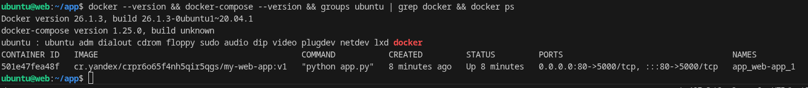
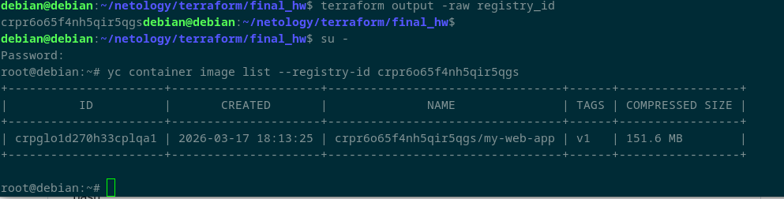
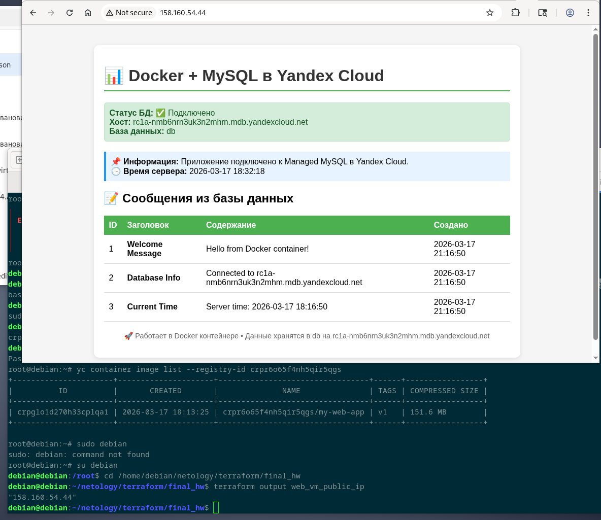
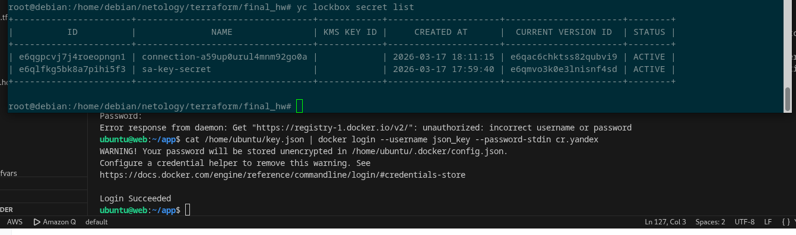

# final_hw

---

## ✅ Выполненные задания

### Задание 1. Инфраструктура в Yandex Cloud

  

  

### Задание 2. Установка Docker и Docker Compose через cloud-init

  

  

### Задание 3. Dockerfile и Container Registry

Проверка образа в registry:

  

  

### Задание 4. Связка приложения с БД

  

  

Задание 5*. LockBox (бонус)
Создание секрета в LockBox:

  

  
