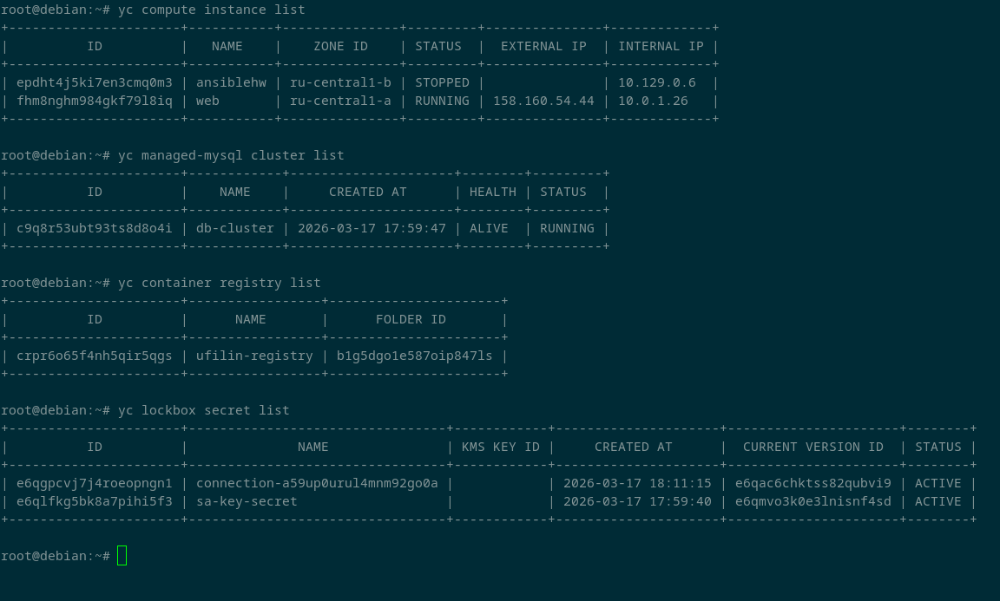

# final_hw

---

## ✅ Выполненные задания

### Задание 1. Инфраструктура в Yandex Cloud

  

  

📸 СКРИНШОТ 1: Вставьте здесь скриншот вывода команд, показывающий созданные ресурсы в Yandex Cloud

### Задание 2. Установка Docker и Docker Compose через cloud-init

Проверка на ВМ:

bash
docker --version
docker-compose --version
groups ubuntu | grep docker
docker ps

  

  

📸 СКРИНШОТ 2: Вставьте здесь скриншот результата выполнения команд на ВМ, подтверждающий установку Docker и запуск контейнера

### Задание 3. Dockerfile и Container Registry

Проверка образа в registry:

bash
yc container image list --registry-id $(terraform output -raw registry_id)

  

  

📸 СКРИНШОТ 3: Вставьте здесь скриншот процесса сборки образа и вывода команды проверки образа в registry

### Задание 4. Связка приложения с БД

bash
# Получить IP виртуальной машины
terraform output web_vm_public_ip

# Проверить эндпоинты
curl http://<IP-адрес>/
curl http://<IP-адрес>/health
curl http://<IP-адрес>/db-test

  

  

📸 СКРИНШОТ 4: Вставьте здесь скриншот вывода curl команд, показывающих успешную работу приложения

  

  

📸 СКРИНШОТ 5: Вставьте здесь скриншот открытого в браузере приложения по публичному IP-адресу

Задание 5*. LockBox (бонус)
Создание секрета в LockBox:

  

  

📸 СКРИНШОТ 6: Вставьте здесь скриншот создания секрета в LockBox и вывода команды yc lockbox secret list

  

  

📸 СКРИНШОТ 7: Вставьте здесь скриншот успешного выполнения docker login на ВМ
